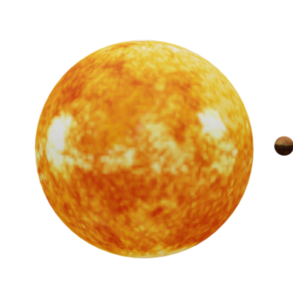

# jsar-gallery-solar-system

A solar system JSAR widget.



## Open

Type the following URL in JSAR runtime:

```sh
https://cdn.jsdelivr.net/gh/M-CreativeLab/jsar-gallery-solar-system@main/main.xsml
```

## License

Apache 2.0

